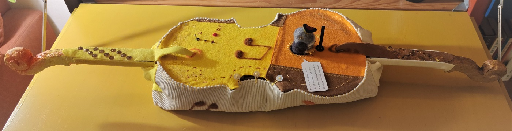
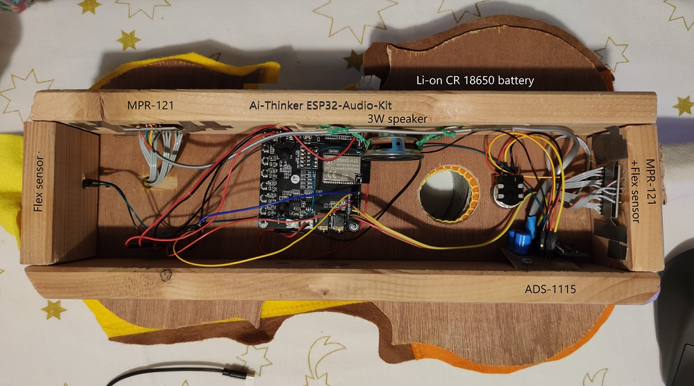

# esp32_midi_sampler as a Saint Nicholas surprise

Forked from [marcel-licence/esp32_midi_sampler](https://github.com/marcel-licence/esp32_midi_sampler) and then turned into a - uhm - cuculin 'musical' instrument.

## Background and idea
The cuculin is a felt electronic synthesizer. The name comes from the little cuckoo bird which is peeking out of the centre (and the fact that we preloaded cuckoo sound wave files). The left hand side plays a preloaded wave file which can be replaced by recording a new sound. The right side plays a standard tone ladder, two hi-hat like sounds and a Christmas bells rythm. The two necks of the instrument can bend upwards to introduce a pitch bend or reverb effect.

This was created as a [Sinterklaas](https://en.wikipedia.org/wiki/Sinterklaas) surprise for someone who crafts (real) violins and who is married to a felt textile artist. 

## Modifications from original midi sampler
- Changed to Platform.io IDE.
- Used 2x MPR-121 to play the midi notes using 24 touch sensors. Mimicking the base notes of a violin in 3 different octaves.
- Used 1x ADS-1115 to read one pot meter for volume control and two flex sensors to pitch bend and set reverb level.
- Added webserver to control the sampler's knobs and sliders. Ran into a lot of memory issues with this one. Could not get soft-AP to work with a captive portal. So had to revert to a static IP on a hardcoded WIFI network :( 
- Recording is done via a separate button, always overwriting the last sample. Note that there is a nasty bug when starting to record during playback.
- [Sinterklaas poem](Poem.md)
- The Cuculin hardware.

---
## Original readme

ESP32 Audio Kit Sampling MIDI Module - A little DIY Arduino based audio/synthesizer project

- video presentation of the initial state of this project https://youtu.be/7uSobNW7_A4 
- little quick start guide to get started with arduino synthesizer / music projects: https://youtu.be/ZNxGCB-d68g

The project is written for the ESP32 Audio Kit V2.2
Arduino Settings:
- Board: ESP32 Dev Module
- PSRAM: Enabled

ESP32 LittleFS Data Upload is required to upload samples into flash.

Compile information:
- board 'esp32' Version 1.0.6
- core 'esp32' Version 1.0.6

Following libraries are used:
- FS in Version 1.0
- LittleFS_esp32 in Version 1.0.6
- SD_MMC in Version 1.0
- WiFi in Version 1.0
- AC101 in Version 0.0.1
- Adafruit_NeoPixel in Version 1.7.0
- Wire in Version 1.0.1

Configuration of the Audio Kit:
- Set DIP 2, 3 to on and all other DIP switches to off (required for SD card access)

To store samples on the ESP32 you can upload them using the Arduino plugin:
- ESP32 LittleFS Data Upload (src: https://github.com/lorol/arduino-esp32littlefs-plugin)

A WS2812 8x8 led matrix can be connected to IO12, 3V3, GND (defined by LED_STRIP_PIN in config.h)
ref: https://hackaday.com/2017/01/20/cheating-at-5v-ws2812-control-to-use-a-3-3v-data-line/

MIDI should be connected to IO18  (you can modify the define MIDI_RX_PIN in config.h)

AS5600 can be now used for scratching. To use it, set the define "AS5600_ENABLED" in config.h as active.
The connection is defined below:
- SDA: IO21
- SCL: IO22
Note: MIDI_RX_PIN changed from IO18 to IO19 on the ESP32 Audio Kit.
In that case you can attach a 160x80 display but its connection will change to:
- MOS: IO23
- SCLK: IO18
- CS: IO5
- DC: IO0
- RST -> should be connected to RST / EN of the ESP32

A controller mapping can be found in z_config.ino.
---
Keys can be used with only one IO by a little modification of the ESP32 Audio Kit (ref: https://youtu.be/r0af0DB1R68)
- move R66-70 to R60-R64 (0 Ohm resistors, you can also put a solder bridge)
- place at R55-R59 a 1.8k resistor
Finally the define AUDIO_KIT_BUTTON_ANALOG in config.h is required

---
If you have questions or ideas please feel free to use the discussion area!

---
External resources:
reverb_module.ino is a ported from stm32 code (src. https://github.com/YetAnotherElectronicsChannel/STM32_DSP_Reverb/blob/master/code/Src/main.c)
A great video explaining the reverb can be found on his channel: https://youtu.be/nRLXNmLmHqM

Specifications and datasheets:
---

ESP32-A1S (AC101 variant): https://www.makerfabs.com/desfile/files/ESP32-A1S%20Product%20Specification.pdf
ESP32-A1S (ES8388 variant): https://github.com/marcel-licence/esp32_midi_sampler/files/7075076/esp32-a1s_v2.3_specification.pdf
AC101 user manual: http://www.x-powers.com/en.php/Info/down/id/96
ES8388 datasheet: http://www.everest-semi.com/pdf/ES8388%20DS.pdf
ES8388 user guide: https://dl.radxa.com/rock2/docs/hw/ds/ES8388%20user%20Guide.pdf

# Derived projects
If you like please let me know if you want to get your project listed here which is based on the esp32_midi_sampler project.
